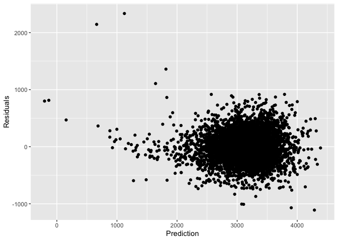
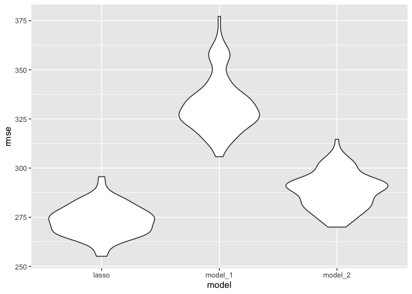
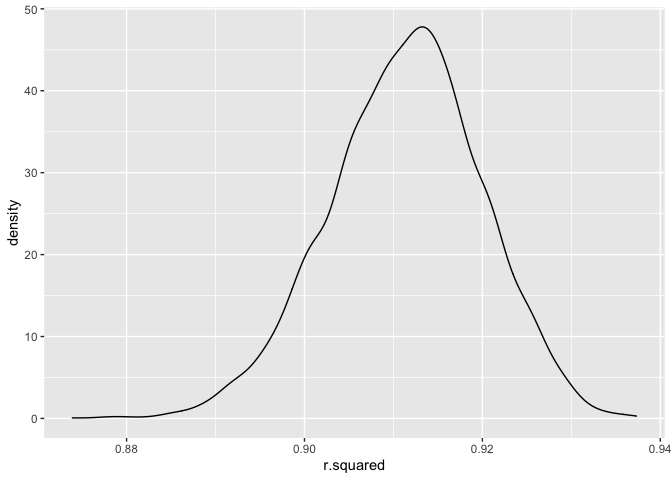
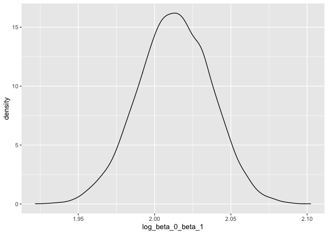

Homework 6
================
Junzhe Shao
12/4/2021

## Problem 1

### data cleaning

``` r
birthw_dt <- read_csv("birthweight.csv")
```

    ## Rows: 4342 Columns: 20

    ## ── Column specification ────────────────────────────────────────────────────────
    ## Delimiter: ","
    ## dbl (20): babysex, bhead, blength, bwt, delwt, fincome, frace, gaweeks, malf...

    ## 
    ## ℹ Use `spec()` to retrieve the full column specification for this data.
    ## ℹ Specify the column types or set `show_col_types = FALSE` to quiet this message.

``` r
#nrows(birthw_dt %>% drop_na())
birthw_dt = birthw_dt %>% mutate(babysex = factor(babysex),
                                 frace = factor(frace),
                                 malform = factor(malform),
                                 mrace = factor(mrace))
```

we find that we still have 4342 variables after removing NA, so there is
no missing value for the original data. and convert numeric to factor
where appropriate.

We try a discovery of variables using lasso.

``` r
y = birthw_dt %>% select(bwt) %>% data.matrix()
x = birthw_dt %>% select(-bwt) %>% data.matrix()
set.seed(1)
cv_model <- cv.glmnet(x, y, alpha = 1)
#plot(cv_model)
lambda_se = cv_model$lambda.1se
best_model <- glmnet(x, y, alpha = 1, lambda = lambda_se)
c =  coef(best_model)
inds<-which(c!=0)
variables<-row.names(c)[inds][-1]
f = paste("bwt ~ ",paste(variables, collapse = " + "),sep = "")
#cat(f)
```

using the variables selected through lasso, the new formula is bwt \~
bhead + blength + delwt + fincome + frace + gaweeks + mheight + mrace +
smoken + wtgain

``` r
model = lm(as.formula(f), data = birthw_dt)
model %>% broom::tidy()
```

    ## # A tibble: 16 × 5
    ##    term         estimate std.error statistic   p.value
    ##    <chr>           <dbl>     <dbl>     <dbl>     <dbl>
    ##  1 (Intercept) -6035.      137.     -44.0    0        
    ##  2 bhead         129.        3.41    37.8    1.22e-270
    ##  3 blength        74.8       2.02    37.0    4.20e-260
    ##  4 delwt           1.44      0.233    6.20   6.26e- 10
    ##  5 fincome         0.301     0.175    1.72   8.62e-  2
    ##  6 frace2         11.0      46.2      0.238  8.12e-  1
    ##  7 frace3         19.5      69.4      0.280  7.79e-  1
    ##  8 frace4        -49.7      44.7     -1.11   2.66e-  1
    ##  9 frace8          3.91     74.2      0.0527 9.58e-  1
    ## 10 gaweeks        11.8       1.45     8.11   6.49e- 16
    ## 11 mheight         6.71      1.79     3.75   1.76e-  4
    ## 12 mrace2       -151.       46.1     -3.27   1.09e-  3
    ## 13 mrace3        -94.1      71.9     -1.31   1.91e-  1
    ## 14 mrace4        -53.5      45.2     -1.19   2.36e-  1
    ## 15 smoken         -4.97      0.587   -8.47   3.21e- 17
    ## 16 wtgain          2.68      0.428    6.26   4.12e- 10

``` r
res = add_residuals(birthw_dt, model)
pred = add_predictions(birthw_dt, model)

#residual and prediction data
res %>%mutate(
    pred = pull(pred,pred)
  ) %>% 
ggplot(aes(x = pred, y = resid)) + 
  geom_point() +
  labs(
    x = "Prediction",
    y = "Residuals"
  )
```

<!-- -->

``` r
set.seed(1)
cv_df <- crossv_mc(birthw_dt, n = 100) %>% 
  mutate(
    train = map(train, as_tibble),
    test = map(test, as_tibble)
  )

cv_result <- cv_df %>% 
  mutate(
    lasso_model  = map(train, ~lm(as.formula(f), data = .x)),
    model_1 = map(train, ~lm(bwt ~ blength + gaweeks, data = .x)),
    model_2  = map(train, ~lm(bwt ~ bhead + blength + babysex + bhead * blength + bhead * babysex + blength * babysex + bhead * blength * babysex, data = .x))
  ) %>% 
  mutate(
    rmse_lasso = map2_dbl(lasso_model, test, ~rmse(model = .x, data = .y)),
    rmse_model_1    = map2_dbl(model_1, test, ~rmse(model = .x, data = .y)),
    rmse_model_2 = map2_dbl(model_2, test, ~rmse(model = .x, data = .y))
  )
cv_result %>% 
  select(starts_with("rmse")) %>% 
  pivot_longer(
    everything(),
    names_to = "model", 
    values_to = "rmse",
    names_prefix = "rmse_") %>% 
  mutate(model = fct_inorder(model)) %>% 
  ggplot(aes(x = model, y = rmse)) + geom_violin()
```

<!-- --> \#
Problem 2

``` r
#load data
weather_df = 
  rnoaa::meteo_pull_monitors(
    c("USW00094728"),
    var = c("PRCP", "TMIN", "TMAX"), 
    date_min = "2017-01-01",
    date_max = "2017-12-31") %>%
  mutate(
    name = recode(id, USW00094728 = "CentralPark_NY"),
    tmin = tmin / 10,
    tmax = tmax / 10) %>%
  select(name, id, everything())
```

    ## Registered S3 method overwritten by 'hoardr':
    ##   method           from
    ##   print.cache_info httr

    ## using cached file: ~/Library/Caches/R/noaa_ghcnd/USW00094728.dly

    ## date created (size, mb): 2021-12-04 22:21:57 (7.616)

    ## file min/max dates: 1869-01-01 / 2021-12-31

``` r
set.seed(1)
boot_straps <- weather_df %>%
  modelr::bootstrap(n = 5000)

res_boot = boot_straps %>%
  mutate(
    models = map(strap, ~lm(tmax ~ tmin , data = .x) ),
    glance = map(models, broom::glance),
    tidy= map(models, broom::tidy)
  ) %>%
  select(c(-strap,-models))

res_boot %>% unnest(glance)%>% 
  ggplot(aes(x = r.squared)) + geom_density()
```

<!-- -->

``` r
coef = res_boot %>% unnest(tidy) %>% select(.id,term, estimate) %>% 
  pivot_wider(
    names_from = term,
    values_from = estimate
  ) %>% mutate(log_beta_0_beta_1 = log(`(Intercept)` * tmin))
res_boot %>% unnest(tidy) %>% select(.id,term, estimate) %>% 
  pivot_wider(
    names_from = term,
    values_from = estimate
  ) %>% mutate(log_beta_0_beta_1 = log(`(Intercept)` * tmin))%>% 
  ggplot(aes(x = log_beta_0_beta_1)) + geom_density()
```

<!-- -->
Both of these parameters’ result of bootstrapping are normally
distributed.

The 95% confidence intervals for *r̂*<sup>2</sup> and
log (*β̂*<sub>0</sub>\**β̂*<sub>1</sub>):

``` r
res_boot %>% unnest(glance)%>% 
  summarize(
    ci_lower = quantile(r.squared, 0.025), 
    ci_upper = quantile(r.squared, 0.975))
```

    ## # A tibble: 1 × 2
    ##   ci_lower ci_upper
    ##      <dbl>    <dbl>
    ## 1    0.894    0.927

``` r
res_boot %>% unnest(tidy) %>% select(.id,term, estimate) %>% 
  pivot_wider(
    names_from = term,
    values_from = estimate
  ) %>% mutate(log_beta_0_beta_1 = log(`(Intercept)` * tmin))%>% 
  summarize(
    ci_lower = quantile(log_beta_0_beta_1, 0.025), 
    ci_upper = quantile(log_beta_0_beta_1, 0.975))
```

    ## # A tibble: 1 × 2
    ##   ci_lower ci_upper
    ##      <dbl>    <dbl>
    ## 1     1.96     2.06
